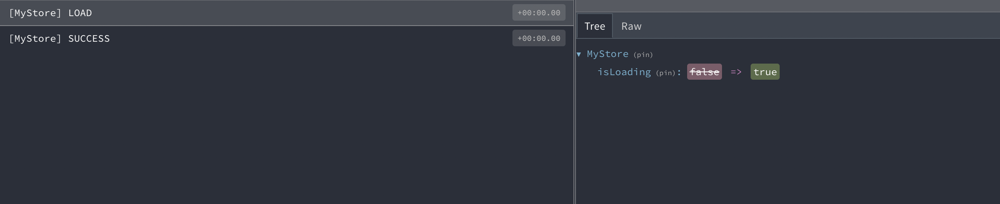
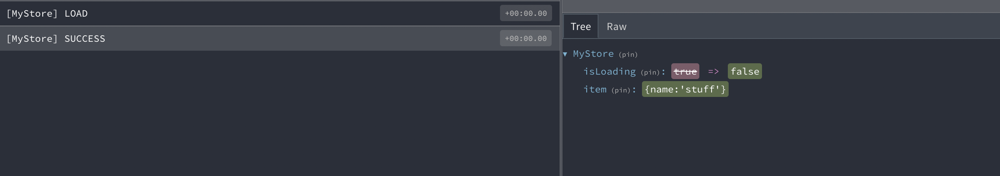

# NgrxLite

### This Lib based on [ngrx](https://github.com/ngrx/platform) component-store, with some benefits 😎

* ⏱ create fast and easy a redux store
* ⏳ integrated loading state
* 🗑 state reset functionality
* ⚒️ Support Redux Devtools for your light components-store (only if you use redux-devtools)
* 💽 support session/locale Storage


### install

yarn: `yarn install @gernsdorfer/ngrx-lite`

npm: `npm install @gernsdorfer/ngrx-lite`

### Usage

```ts
interface MyModel {
  name: string;
}

interface MyError {
  name: string;
}

@Injectable({
  providedIn: 'root',
})
class MyStore {
  // 1. create your Store
  private store = this.storeFactory.getStore<MyModel, MyError>('MyStore');

  // 2. make your state public
  public myState = this.readAssetKiStore.state$;

  // 3. add your effects
  public load = this.readAssetKiStore.createEffect('myEffect', (name) => of({name}));

  constructor(private storeFactory: StoreFactory) {
  }
}
```

That's it 🥳

It's time to use your new Store 👏

```ts

@Component({
  selector: 'my-component',
  templateUrl: './my-component.html',
})
export class EditorContainerComponent {
  constructor(public myStore: MyStore) {
  }

  load() {
    this.myStore.load('stuff');
  }
}
```

### What's going on ? Let's have a look into the the redux devtools

#### Loader State `isloading` changed

You can now show an Loader for your Application



#### Date is ready

You can now show your Data



## Session/Local Storage

#### Register Session/Locale-Storage Service

1. Register Session/Locale-Storage in your Root-Module

```ts
@NgModule({
  // ...
  providers: [
    {provide: SessionStoragePlugin, useValue: sessionStoragePlugin},
    {provide: LocalStoragePlugin, useValue: localStoragePlugin}
  ]
  // ...
})
```

1. Create your new Store with a session Storage Sync Option

```ts
class {
  private store = this.storeFactory.getStore<MyModel, MyError>('MyStore', {storage: 'sessionStoragePlugin'});
}
```

## Devtool support

your must only use and install the [ngrx/store-devtools](https://ngrx.io/guide/store-devtools) 
