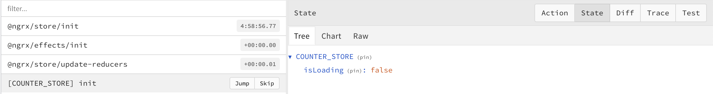
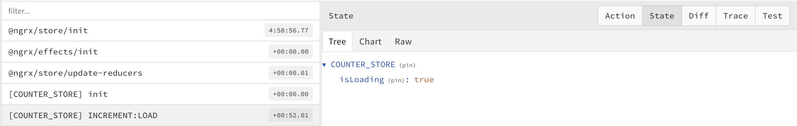
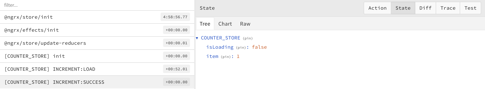
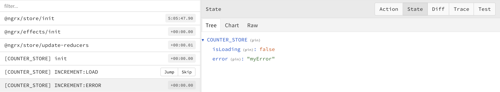

# ComponentLoadingStore

The LoadingStore is based on [ngrx-lite/component-store](/docs/api/component-store) — you have the exact same API
plus `loadingEffect` and `reactiveLoadingEffect`.

Its state is always `LoadingStoreState<ITEM, ERROR>`:

```ts
type LoadingStoreState<ITEM, ERROR> = {
  isLoading: boolean;
  item?: ITEM;
  error?: ERROR;
};
```

## `loadingEffect` {#loadingeffect}

Create your custom load effect. The library sets the loading state while the effect is running. You define the effect
name — `LOAD_NAME` in the example below — and the callback has the same API as
[@ngrx/component-store/effect](https://ngrx.io/guide/component-store/effect).

A `tapResponse` to change your state is not necessary: the effect writes `item` when your stream emits and `error`
when it throws.

```ts title="app.component.ts"
import { Component, inject } from '@angular/core';
import { LoadingStoreState, StoreFactory } from '@gernsdorfer/ngrx-lite';
import { of } from 'rxjs';

type State = LoadingStoreState<{ name: string }, { message: string }>;

@Component({
  /* ... */
})
export class AppComponent {
  private storeFactory = inject(StoreFactory);

  private store = this.storeFactory.createComponentLoadingStore<State['item'], State['error']>({
    storeName: 'LOADING_STORE',
  });

  public state = this.store.state;

  nameEffect = this.store.loadingEffect('LOAD_NAME', (name: string) => of({ name }));
}
```

:::note
Every effect sets `isLoading` to `true` while it runs, so you can show a loading indicator in your UI.
:::

### The effect lifecycle in the DevTools

Each `loadingEffect` dispatches up to three actions. This is what they look like:

**Store is initialized**



**Effect is running — `isLoading` is true**



**Effect succeeded — `item` is set**



**Effect failed — `error` is set**



### Option:skipSamePendingActions

Run an action only once while the effect is still running.

```ts
nameEffect = this.store.loadingEffect('LOAD_NAME', (name: string) => of({ name }), {
  skipSamePendingActions: true,
});
```

### Option:skipSameActions

Run an action only once, after the same action was already running.

```ts
nameEffect = this.store.loadingEffect('LOAD_NAME', (name: string) => of({ name }), {
  skipSameActions: true,
});
```

### Option:repeatActions

Repeat your effect when one of the given actions is dispatched.

```ts
import { createAction, props } from '@ngrx/store';

const mySideAction = createAction('TestAction', props<{ id: string }>());

nameEffect = this.store.loadingEffect('LOAD_NAME', (name: string) => of({ name }), {
  repeatActions: [mySideAction],
});
```

:::tip
To repeat on an action of another ngrx-lite store, build it with [`getEffectAction`](/docs/api/actions#geteffectaction).
:::

### Option:autoLoad

Trigger the loader exactly once on the next microtask after the store is constructed. Only available for
parameter-free effects — passing `autoLoad: true` to a parameterized effect is a compile-time error (enforced via
TypeScript conditional types).

This removes the need for a manual `effect()` block in your component for init loads.

```ts title="config.store.ts"
import { inject, Injectable } from '@angular/core';
import { StoreFactory } from '@gernsdorfer/ngrx-lite';

@Injectable({ providedIn: 'root' })
export class ConfigStore {
  private api = inject(ConfigApi);

  private store = inject(StoreFactory).createComponentLoadingStore<Config, ApiError>({
    storeName: 'CONFIG',
  });

  public state = this.store.state;

  public reload = this.store.loadingEffect('LOAD_CONFIG', () => this.api.getConfig(), {
    autoLoad: true,
  });
}
```

`autoLoad` fires on both server and client (SSR-correct). To suppress the duplicate fetch after hydration, combine it
with `skipWhen`.

### Option:skipWhen

A pre-flight callback that is evaluated before every effect run. When it returns `true`, the dispatch is suppressed —
applies to `autoLoad`, manual calls, and any other trigger.

Typical use cases:

- **SSR hydration:** skip the client-side re-fetch when state is already restored from `TransferState`.
- **Cache hits:** skip when the data is already cached.
- **Feature flags:** gate the call behind a runtime condition.

```ts title="config.store.ts"
@Injectable({ providedIn: 'root' })
export class ConfigStore {
  private api = inject(ConfigApi);
  private transferState = inject(StoreTransferState);

  private store = inject(StoreFactory).createComponentLoadingStore<Config, ApiError>({
    storeName: 'CONFIG',
  });

  public state = this.store.state;

  public reload = this.store.loadingEffect('LOAD_CONFIG', () => this.api.getConfig(), {
    autoLoad: true,
    skipWhen: () => this.transferState.hasRestored('CONFIG'),
  });
}
```

The library itself stays SSR-agnostic. Server-side fetching, hydration, and `TransferState` integration live in your
application code; `skipWhen` is the hook the library exposes for it.

:::caution
`canCache` is deprecated — use `skipSamePendingActions` instead.
:::

## `reactiveLoadingEffect` {#reactiveloadingeffect}

`reactiveLoadingEffect` binds a `Signal<P>` source to the loading lifecycle. The container provides the source; the
store owns the loading mechanics. It is built on top of `loadingEffect`, so action stream, DevTools, and
`repeatActions` behave identically.

### Mental model: Owner / Driver vs. Consumer

- **Owner / Driver:** the one container that calls the connect function (typically a route container). Decides when and how loading happens.
- **Consumer:** any number of components that `inject()` the store and read `state()` — read-only.

The library enforces the convention with a single-connect guard: a second parallel-active connect for the same store
name logs `console.error` in development mode (silent in production).

### Owner store

```ts title="professional-list.store.ts"
@Injectable({ providedIn: 'root' })
export class ProfessionalListStore {
  private api = inject(ProfessionalApi);

  private store = inject(StoreFactory).createComponentLoadingStore<Professional[], ApiError>({
    storeName: 'PROFESSIONAL_LIST',
  });

  public state = this.store.state;

  public connect = this.store.reactiveLoadingEffect('load', (params: SearchParams) => this.api.search(params), {
    skipSameActions: true,
  });
}
```

### Owner / Driver component

```ts title="search-page.component.ts"
@Component({
  /* ... */
})
export class SearchPageComponent {
  private filter = signal<SearchParams>({
    /* ... */
  });
  private connected = inject(ProfessionalListStore).connect(this.filter);
}
```

### Consumer component

```ts title="result-list.component.ts"
@Component({
  template: `
    @for (p of store.state().item; track p.id) {
      <div>{{ p.name }}</div>
    }
  `,
})
export class ResultListComponent {
  protected store = inject(ProfessionalListStore);
}
```

### Behavior notes

- A new source value during a pending loader call **cancels the in-flight request automatically** (`switchMap` behavior — not configurable).
- `DestroyRef` of the calling injection context tears down the effect and frees the connect slot when the component unmounts.
- Default `skipSameActions: false` — pass `true` for signal sources where `computed()`-derived values produce new object references on every dependency update.
- For multi-source binding, merge upstream signals with `computed()` before passing one signal to `connect` — there is no API knob for it.

### Options

```ts
reactiveLoadingEffect<P>(
  name: string,
  loader: (params: P) => Observable<ITEM>,
  options?: {
    skipSameActions?: boolean;          // default false; recommend true for signal sources
    skipSamePendingActions?: boolean;   // default false
    skipWhen?: (params: P) => boolean;  // pre-flight skip with param access
    repeatActions?: ActionCreator[];    // re-fire when any of these actions dispatch
  },
): (source: Signal<P>) => void
```

## `getDefaultComponentLoadingState` {#getdefaultcomponentloadingstate}

Builds a complete `LoadingStoreState` from a partial one, filling in `isLoading: false` and the missing keys.
It is mostly useful in tests, where it saves you from spelling out every property when asserting against the state.

```ts title="app.component.spec.ts"
import { getDefaultComponentLoadingState } from '@gernsdorfer/ngrx-lite';

expect(component.state()).toEqual(
  getDefaultComponentLoadingState<State['item'], State['error']>({
    item: { name: 'my name' },
  }),
);
```

## Success and error streams

The effect writes `item` when your stream emits:

```ts
nameEffect = this.store.loadingEffect('LOAD_NAME', (name: string) => of({ name }));
```

…and `error` when it throws:

```ts
import { throwError } from 'rxjs';

nameEffect = this.store.loadingEffect('LOAD_NAME', () => throwError(() => ({ errorCode: 'myError' })));
```

:::caution
Note the parentheses around the object literal — `() => ({ … })` returns an object, while `() => { … }` is a
function body and returns `undefined`.
:::
